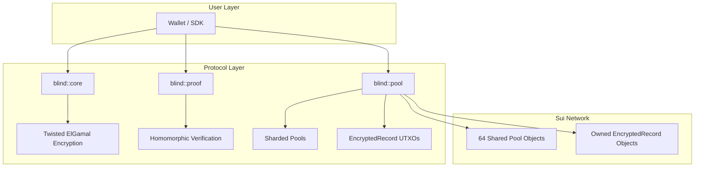

# 0xBlind: Parallelized Probabilistic Privacy Protocol (P4)

## Overview

0xBlind is a privacy protocol for the Sui Network that enables confidential value transfers using homomorphic encryption and sharded privacy pools. The protocol leverages Sui's object-centric model and parallel execution capabilities to achieve scalable privacy without the bottlenecks of traditional single-pool designs.

## Architecture



## Cryptographic Foundation

### Twisted ElGamal on BLS12-381 G1

We use a modified ElGamal encryption scheme that supports additive homomorphism:

| Component | Description |
| :--- | :--- |
| **Curve** | BLS12-381 G1 (256-bit security) |
| **Generator G** | Standard BLS12-381 G1 generator |
| **Generator H** | Second independent generator (H = 12345 × G for PoC) |
| **Encryption** | Enc(m, r) = (R, S) where R = rG and S = rH + mG |

### Homomorphic Properties

```
Enc(m₁, r₁) + Enc(m₂, r₂) = Enc(m₁ + m₂, r₁ + r₂)
Enc(m₁, r₁) - Enc(m₂, r₂) = Enc(m₁ - m₂, r₁ - r₂)
```

This allows us to verify that transactions preserve value without revealing the actual amounts.

## Protocol Operations

### 1. Shielding (Fund)

Convert public SUI to private balance:

```
User sends:    Coin<SUI>(100)
Pool receives: balance += 100
User receives: EncryptedRecord(Enc(100, r))
```

### 2. Private Transfer (Split)

Split one encrypted note into two with randomness rotation:

```
Input:  EncryptedRecord(Enc(100, r_in))
Output: EncryptedRecord(Enc(40, r₁)) + EncryptedRecord(Enc(60, r₂))

Verification: Enc(100) - (Enc(40) + Enc(60)) = Enc(0, r_delta)
              where r_delta = r_in - (r₁ + r₂)
```

### 3. Unshielding (Withdraw)

Convert private balance back to public SUI:

```
User sends:    EncryptedRecord(Enc(m, r)), reveals (m, r)
Pool verifies: Ciphertext == Enc(m, r)
User receives: Coin<SUI>(m)
```

## Module Structure

### `blind::core` (sources/core.move)

Core cryptographic primitives:

| Function | Description |
| :--- | :--- |
| `encrypt(m, r)` | Create Twisted ElGamal ciphertext |
| `add(c1, c2)` | Homomorphic addition |
| `sub(c1, c2)` | Homomorphic subtraction |
| `verify_encryption(c, m, r)` | Verify ciphertext opening |
| `is_equal(c1, c2)` | Compare two ciphertexts |

### `blind::proof` (sources/proof.move)

Zero-knowledge verification:

| Function | Description |
| :--- | :--- |
| `verify_split(in, out1, out2)` | Strict sum check |
| `verify_split_with_rotation(in, out1, out2, r_delta)` | Sum check with randomness rotation |
| `verify_range_proof(c)` | Placeholder for Bulletproofs |

### `blind::pool` (sources/pool.move)

State management:

| Function | Description |
| :--- | :--- |
| `init()` | Create 64 sharded Pool objects |
| `fund(pool, coin, r)` | Deposit SUI, mint EncryptedRecord |
| `split(record, out1, out2, r_delta)` | Private transfer |
| `withdraw(pool, record, r, amount)` | Burn record, release SUI |

## Sharding Architecture

The protocol uses 64 parallel Pool objects to avoid contention:

```
Pool[0]  Pool[1]  Pool[2]  ...  Pool[63]
   ↓        ↓        ↓            ↓
 User A   User B   User C  ...  User N
   ↓        ↓        ↓            ↓
  (Parallel Execution on Sui)
```

Each pool is a Sui Shared Object. Users can deposit to any pool, and withdrawals are pool-specific.

## Security Considerations

### Implemented

- ✅ Homomorphic balance verification
- ✅ Randomness rotation (unlinkability)
- ✅ Parallel execution (no single point of contention)

### Requires Production Implementation

- ⚠️ **Range Proofs**: Currently mocked. Required to prevent negative balance exploits.
- ⚠️ **H Generator**: Should be derived via hash-to-curve, not hardcoded.
- ⚠️ **Timing Attacks**: Consider commit-reveal scheme for front-running protection.

## Testing

```bash
sui move test
```

| Test | Description |
| :--- | :--- |
| `test_homomorphic_addition` | Verify Enc(5) + Enc(15) = Enc(20) |
| `test_pool_creation_and_funding` | Full fund flow |
| `test_split_functionality` | Basic split (r_delta = 0) |
| `test_full_cycle` | Fund → Split → Withdraw |
| `test_split_with_rotation` | Split with randomness rotation |

## Dependencies

```toml
[dependencies]
Sui = { git = "https://github.com/MystenLabs/sui.git", subdir = "crates/sui-framework/packages/sui-framework", rev = "testnet-v1.51.1" }
```

## License

MIT
